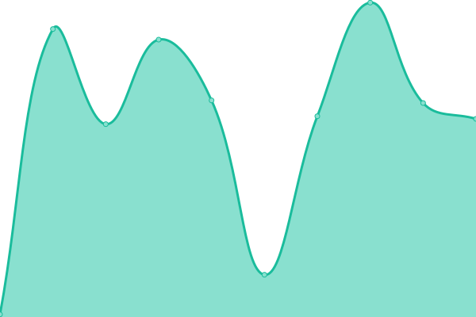

# [📈 Live Status](https://upptime.xlorpaste.cn): <!--live status--> **🟩 All systems operational**

This repository contains the open-source uptime monitor and status page for [XLorPaste](https://xlorpaste.cn), powered by [Upptime](https://github.com/upptime/upptime).

With [Upptime](https://upptime.js.org), you can get your own unlimited and free uptime monitor and status page, powered entirely by a GitHub repository. We use [Issues](https://github.com/XLorPaste/upptime/issues) as incident reports, [Actions](https://github.com/XLorPaste/upptime/actions) as uptime monitors, and [Pages](https://upptime.xlorpaste.cn) for the status page.

<!--start: status pages-->
<!-- This summary is generated by Upptime (https://github.com/upptime/upptime) -->
<!-- Do not edit this manually, your changes will be overwritten -->
<!-- prettier-ignore -->
| URL | Status | History | Response Time | Uptime |
| --- | ------ | ------- | ------------- | ------ |
|  [XLorPaste](https://xlorpaste.cn/) | 🟩 Up | [x-lor-paste.yml](https://github.com/XLorPaste/upptime/commits/HEAD/history/x-lor-paste.yml) | 

 2007ms
     
 | 

<a href="https://upptime.xlorpaste.cn/history/x-lor-paste">100.00%</a>
    

|  [XLorPaste EN](https://en.xlorpaste.cn/) | 🟩 Up | [x-lor-paste-en.yml](https://github.com/XLorPaste/upptime/commits/HEAD/history/x-lor-paste-en.yml) | 

 686ms
     
 | 

<a href="https://upptime.xlorpaste.cn/history/x-lor-paste-en">100.00%</a>
    

|  [XLorPaste API](https://paste.cpany.dev/) | 🟩 Up | [x-lor-paste-api.yml](https://github.com/XLorPaste/upptime/commits/HEAD/history/x-lor-paste-api.yml) | 

 160ms
     
 | 

<a href="https://upptime.xlorpaste.cn/history/x-lor-paste-api">100.00%</a>
    

|  [XLorPaste View Code API](https://paste.cpany.dev/towqab) | 🟩 Up | [x-lor-paste-view-code-api.yml](https://github.com/XLorPaste/upptime/commits/HEAD/history/x-lor-paste-view-code-api.yml) | 

 159ms
     
 | 

<a href="https://upptime.xlorpaste.cn/history/x-lor-paste-view-code-api">100.00%</a>
    

|  [AnimePaste](https://anime.xlorpaste.cn/) | 🟩 Up | [anime-paste.yml](https://github.com/XLorPaste/upptime/commits/HEAD/history/anime-paste.yml) | 

 1176ms
     
 | 

<a href="https://upptime.xlorpaste.cn/history/anime-paste">100.00%</a>
    

<!--end: status pages-->

[**Visit our status website →**](https://upptime.xlorpaste.cn)

## 📄 License

- Code: [MIT](./LICENSE) © [XLorPaste](https://xlorpaste.cn)
- Data in the `./history` directory: [Open Database License](https://opendatacommons.org/licenses/odbl/1-0/)
